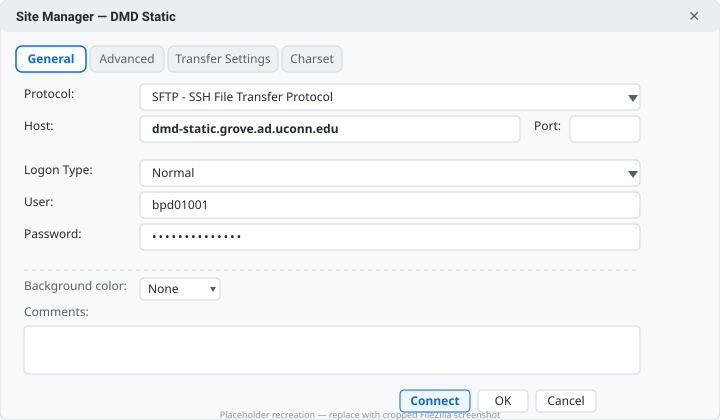
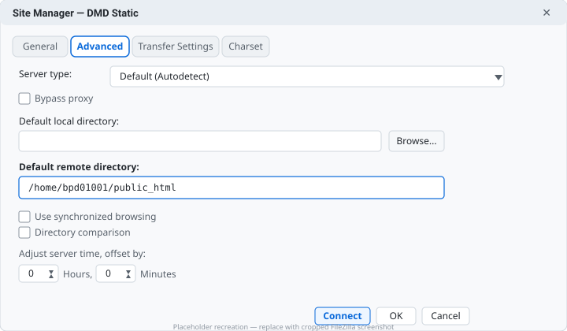

import { Aside, Card, CardGrid, Steps, Tabs, TabItem } from '@astrojs/starlight/components';
import { Quiz } from 'starlight-quiz/components';

:::caution
**Network requirement — read first.** The DMD server `dmd-static.grove.ad.uconn.edu` does **not** allow connections from outside the UConn network.

- **On campus:** you **must** be on **`UCONN-SECURE`** Wi-Fi. `UCONN-PUBLIC` will **not** work — you will time out.
- **Off campus:** you **must** connect through the **Cisco AnyConnect VPN** (UConn VPN). Without it you cannot reach the server.

If you are on `UCONN-PUBLIC`, at a coffee shop, or on home Wi-Fi without VPN, stop and fix the network first before troubleshooting FileZilla.
:::

This lab picks up right after the three FileZilla videos. You will create a saved SFTP connection, set your remote directory, connect, and confirm your site is live at `https://dmd-static.grove.ad.uconn.edu/~NETID/`.

## What success looks like

When you are done you will have:

- A saved **Site Manager** entry for `dmd-static.grove.ad.uconn.edu` using **SFTP**
- A successful connection with your remote `public_html` folder visible
- Your `index.html` (and any assets) uploaded and viewable at your `~NETID` URL

Related videos: [Installing FileZilla](./installing-filezilla-video) · [Local Environment Setup](./local-environment-setup-video) · [Uploading Files](./uploading-files-video)

---

## Prerequisites

Before you start, confirm you have:

- [ ] **FileZilla Client** installed (not Server) — see [Installing FileZilla](./installing-filezilla-video)
- [ ] Your **UConn NetID** and **NetID password** (same as HuskyCT / email)
- [ ] A local site folder with an `index.html` — even a one-line `<h1>Hello</h1>` is enough for the test
- [ ] Access to **UCONN-SECURE** (on campus) **or** **Cisco AnyConnect VPN** installed and connected (off campus) — [UConn VPN instructions](https://vpn.uconn.edu) / [UITS Knowledge Base — VPN](https://kb.uconn.edu/space/IKB/10732832562/Cisco+AnyConnect+VPN)

<Aside type="tip" title="SFTP vs FTP — why the label matters">
You will see `SFTP - SSH File Transfer Protocol` in FileZilla. The course sometimes says “FTP” as shorthand, but the DMD server **only** speaks **SFTP** (FTP over SSH). If you pick `FTP` or `FTPS` the connection will be refused.
</Aside>

---

## Part 1 — Get on the UConn network

<Steps>

1. **Choose your path:**
   - **On campus:** Join Wi-Fi `UCONN-SECURE` with your NetID. Verify you are *not* on `UCONN-PUBLIC` (check the Wi-Fi menu — `UCONN-PUBLIC` has no lock icon).
   - **Off campus:** Install and launch **Cisco AnyConnect** from [vpn.uconn.edu](https://vpn.uconn.edu), sign in with your NetID, and complete Duo if prompted. Keep AnyConnect **connected** for the entire lab.

2. **Quick network check:** With VPN/Secure connected, try visiting [https://dmd-static.grove.ad.uconn.edu/](https://dmd-static.grove.ad.uconn.edu/) in your browser. You should reach the server (you may see a directory page or 403 — either means the network path is open). If it never loads, your network is still the problem — not FileZilla.

</Steps>

---

## Part 2 — Create the Site Manager entry (General tab)

<Steps>

1. Open **FileZilla → File → Site Manager** (or `Ctrl/Cmd + S`) and click **New Site**. Name it `DMD Static` or `UConn DMD`.

2. In the **General** tab, enter exactly:

   | Field | Value |
   |---|---|
   | **Protocol** | `SFTP - SSH File Transfer Protocol` |
   | **Host** | `dmd-static.grove.ad.uconn.edu` |
   | **Port** | *(leave blank — defaults to 22 for SFTP)* |
   | **Logon Type** | `Normal` |
   | **User** | Your **NetID** (e.g., `bpd01001`) — **not** your email |
   | **Password** | Your **NetID password** |
   | Background color / Comments | *(leave as None / blank)* |

   

3. **Do not click Connect yet** — finish the Advanced tab next so uploads land in the right folder.

</Steps>

<Aside type="note" title="Common mistakes on this tab">
- Host typo `dmd-static.grove.uconn.edu` (missing `.ad.`) → “Unknown host”
- Protocol left on `FTP` → connection refused / timeout
- User entered as `bpd01001@uconn.edu` → authentication failed (use just the NetID)
</Aside>

---

## Part 3 — Set the default remote directory (Advanced tab)

<Steps>

1. Click the **Advanced** tab in the same Site Manager entry.

2. Set:

   | Field | Value |
   |---|---|
   | **Default remote directory** | `/home/YOURNETID/public_html` — replace `YOURNETID` with your NetID, e.g., `/home/bpd01001/public_html` |
   | **Default local directory** | *(optional)* Click **Browse** and point to your local site folder — saves clicks later |
   | Server Type | `Default (Autodetect)` |
   | Bypass proxy / Synchronized browsing / Directory comparison | *(leave unchecked)* |

   

   <Aside type="tip">
   Once this is set, every time you connect FileZilla will start inside `public_html` — the only folder the web server serves. Files placed *outside* `public_html` (e.g., in `/home/NETID/` directly) will **not** appear on your site.
   </Aside>

3. Click **Connect** (or **OK** then **Connect** from Site Manager).

4. **First-connect prompts:**
   - **Unknown host key:** Check “Always trust this host” → **OK**.
   - **Duo 2FA (if enabled):** Approve the push on your phone — the FileZilla status log will pause until you do.
   - The status log at the top should end with `Status: Connected` and the right-hand **Remote site** pane should list `public_html` contents.

</Steps>

---

## Part 4 — Upload and verify

<Steps>

1. In the **left** pane (Local site) navigate to your site folder. In the **right** pane (Remote site) you should already be in `/home/NETID/public_html` — if not, double-click `public_html` to enter it.

2. **Drag** `index.html` (and `css/`, `images/` if you have them) from left → right. Watch the **Queued files / Failed transfers / Successful transfers** tabs at the bottom. All should move to **Successful**.

3. Right-click the uploaded `index.html` on the remote pane → **File permissions** — leave defaults unless your instructor says otherwise.

4. **View your site:** Open `https://dmd-static.grove.ad.uconn.edu/~YOURNETID/` in Chrome (replace `YOURNETID`, keep the `~` and trailing `/`). Try a hard refresh: `Ctrl + Shift + R` (Windows) or `Cmd + Shift + R` (Mac).

   :::tip
   The tilde `~` matters. `https://dmd-static.grove.ad.uconn.edu/bpd01001/` (without `~`) will 404. The correct form is always `https://dmd-static.grove.ad.uconn.edu/~NETID/` — see the **Root Directory** note in the server docs.
   :::

5. **Make a visible edit test:** Change `<h1>` in your local `index.html` to `<h1>Hello from DMD Static — it works!</h1>`, save, re-drag to Remote, hard-refresh the `~NETID` URL. If the new text appears, your deploy loop is working.

</Steps>

---

## Troubleshooting

<Tabs>
  <TabItem label="Can't connect / timeout">

  **Status: `Connection timed out` / `Could not connect to server`**

  - You are not on the UConn network. Switch from `UCONN-PUBLIC` → `UCONN-SECURE`, or start **Cisco AnyConnect VPN** and try again. Off-campus without VPN will *always* time out — this is expected.
  - Verify Host is exactly `dmd-static.grove.ad.uconn.edu` (note `.ad.`), Protocol is `SFTP`, Port is blank. A single typo blocks the handshake.
  - Try the browser check from Part 1. If `https://dmd-static.grove.ad.uconn.edu/` also never loads, the network — not FileZilla — is the issue.
  </TabItem>
  <TabItem label="Auth failed">

  **Status: `Authentication failed` / `Access denied`**

  - User is **NetID only** (`bpd01001`), not email. Password is **NetID password** (same as HuskyCT). Test by logging into HuskyCT in another tab.
  - Logon Type must be `Normal` (not `Anonymous` or `Ask`).
  - Duo timed out? Approve promptly — you have ~30 seconds. If it expires, click **Reconnect** and approve faster.
  </TabItem>
  <TabItem label="Wrong folder">

  **Connected but site shows 404 / old content**

  - You uploaded to `/home/NETID/` instead of `/home/NETID/public_html/`. Drag files **into** `public_html` on the remote pane.
  - Verify the remote path bar reads `/home/NETID/public_html` after connecting.
  - Check the URL: it must be `https://dmd-static.grove.ad.uconn.edu/~NETID/` with `~` and trailing `/`.
  </TabItem>
  <TabItem label="Changes not showing">

  **Upload succeeded but browser shows old page**

  - Hard refresh (`Ctrl/Cmd + Shift + R`). Chrome caches aggressively.
  - Confirm the correct file was transferred — check the **Successful transfers** tab and the remote pane timestamp.
  - File naming: `index.html` must be lowercase, with extension. `Index.html` or `index` (no extension) will 404 per [File & Folder Naming](./naming-files).
  - Related: [Why index.html?](./why-index)
  </TabItem>
  <TabItem label="Duo / host key">

  **Stuck on host key or Duo**

  - Host key: check “Always trust this host, add this key to the cache” → **OK**. If you click Cancel you stay disconnected.
  - Duo: watch your phone — no notification? Open the Duo app and check for a pending approval. Still nothing → Disconnect, reconnect, and have the phone ready.
  </TabItem>
</Tabs>

---

## Quick-reference card

<CardGrid>
  <Card title="Connection" icon="setting">
    **Host:** `dmd-static.grove.ad.uconn.edu` 
    **Protocol:** `SFTP - SSH File Transfer Protocol` 
    **Port:** *(blank → 22)* 
    **Logon:** `Normal` → NetID + NetID password
  </Card>
  <Card title="Paths" icon="document">
    **Remote:** `/home/NETID/public_html` 
    **View URL:** `https://dmd-static.grove.ad.uconn.edu/~NETID/` 
    Replace `NETID` with your own. Keep the `~`!
  </Card>
  <Card title="Network" icon="warning">
    ✅ `UCONN-SECURE` or `Cisco AnyConnect VPN` 
    ❌ `UCONN-PUBLIC` / home Wi-Fi alone 
    Test: can you load `https://dmd-static.grove.ad.uconn.edu/`?
  </Card>
</CardGrid>

---

## Check your understanding

<Quiz id="dmd-server-network" title="Network requirement">
Which network connections allow you to reach `dmd-static.grove.ad.uconn.edu`? (Choose all that apply)

- [x] On campus on `UCONN-SECURE` Wi-Fi
- [ ] On campus on `UCONN-PUBLIC` Wi-Fi
- [x] Off campus with Cisco AnyConnect VPN connected
- [ ] Off campus on home Wi-Fi without VPN
</Quiz>

<Quiz id="dmd-server-protocol" title="Protocol & host">
What should you enter in FileZilla Site Manager's **General** tab?

- [ ] Protocol `FTP`, Host `dmd-static.grove.uconn.edu`
- [x] Protocol `SFTP - SSH File Transfer Protocol`, Host `dmd-static.grove.ad.uconn.edu`
- [ ] Protocol `FTPS`, Host `dmd-static.grove.ad.uconn.edu`
- [ ] Protocol `SFTP`, Host `ftp.uconn.edu`

Leave **Port** blank — it defaults to 22 for SFTP.
</Quiz>

<Quiz id="dmd-server-credentials" title="Credentials">
For the DMD Static server, the Site Manager **User** and **Password** are:

- [x] Your NetID and NetID password (e.g., `bpd01001`)
- [ ] Your UConn email and email password
- [ ] The host name `dmd-static.grove.ad.uconn.edu` and no password
- [ ] `anonymous` with no password
</Quiz>

<Quiz id="dmd-server-remote-dir" title="Remote directory">
Where must your site files live to be served on the web?

- [ ] `/home/NETID/`
- [x] `/home/NETID/public_html`
- [ ] `/var/www/html`
- [ ] `/public_html` (no NetID)
</Quiz>

<Quiz id="dmd-server-view-url" title="Viewing your site">
Your live site URL is:

- [ ] `https://dmd-static.grove.ad.uconn.edu/bpd01001/`
- [x] `https://dmd-static.grove.ad.uconn.edu/~bpd01001/` (replace `bpd01001` with your NetID)
- [ ] `https://dmd-static.grove.ad.uconn.edu/~bpd01001/public_html/`
- [ ] `sftp://dmd-static.grove.ad.uconn.edu/bpd01001/`

The tilde `~` is required and the folder part is case-sensitive.
</Quiz>

---

## Completion checklist

Before you move on, confirm:

- [ ] I can **Connect** without timeout (UCONN-SECURE or VPN active)
- [ ] Remote pane opens to `/home/NETID/public_html`
- [ ] My `index.html` appears on the right after drag-and-drop and in **Successful transfers**
- [ ] `https://dmd-static.grove.ad.uconn.edu/~NETID/` shows my page (hard refresh tested)
- [ ] I made a small edit, re-uploaded, and saw the change live

**Stuck?** Work through [Troubleshooting](#troubleshooting) top-to-bottom, then ask in class with a screenshot of the FileZilla **status log** (top pane) — it tells us whether the failure is network, auth, or path.

**Next:** [Why index.html?](./why-index) — how the server maps URLs to `index.html` and why the filename matters.
