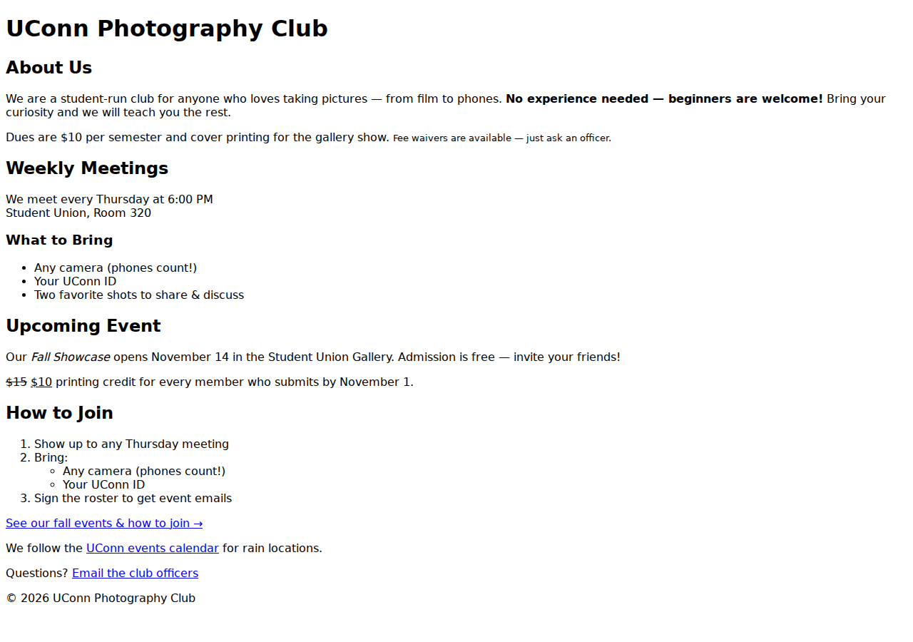
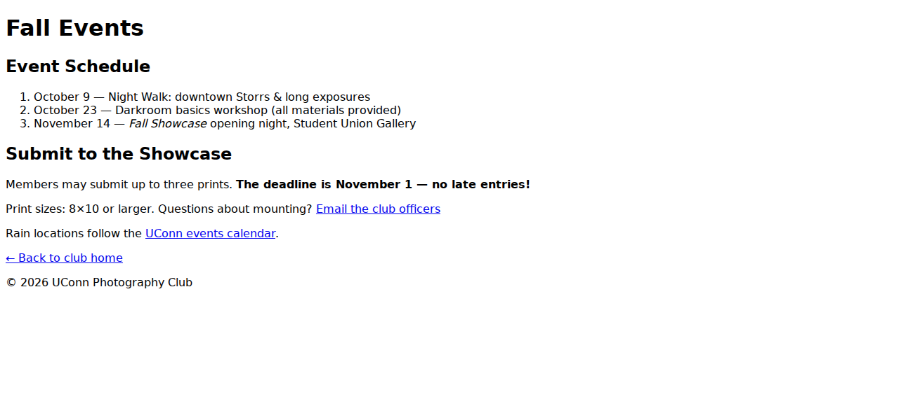

import { Aside, Steps, Tabs, TabItem } from '@astrojs/starlight/components';
import { Quiz } from 'starlight-quiz/components';

Your campus club needs a simple announcement site — and the designer hasn't joined yet. No CSS, no JavaScript, no images required. Just clean, valid HTML that a real visitor can read and navigate.

You will build a **two-page site** in VS Code, validate both pages, then upload them to the DMD server so they are live on the web.

## What success looks like

When you are done you will have:

- Two valid HTML files in the same folder: `index.html` (club home) and `events.html` (event details / how to join)
- A working **relative link** between the two pages in both directions
- One **absolute link** (e.g. UConn or the club's national org) and one **`mailto:`** contact link
- Both pages live at `https://dmd-static.grove.ad.uconn.edu/~NETID/` and `.../~NETID/events.html`

Your finished pages will look plain — no colors, no layout styling. That is correct! Here is the example solution rendered in a browser (unstyled HTML, exactly as yours should look):





Related pages: [Document Structure](./document-structure) · [Headings](./headings) · [Lists](./lists) · [Links](./links) · [Validating HTML](./validating-html) · [Intro to DevTools](./intro-to-devtools) · [Connecting to the DMD Server](../getting-started/lab-connecting-to-dmd-server)

---

## Prerequisites

Before you start, confirm you have:

- [ ] **VS Code** with a local site folder (e.g. `dmd-1070-lab/`) — see [Creating a new HTML file](./creating-html-file-video)
- [ ] **FileZilla connected** to `dmd-static.grove.ad.uconn.edu` via SFTP with remote folder `/home/NETID/public_html` — see [Connecting to the DMD Server](../getting-started/lab-connecting-to-dmd-server)
- [ ] Access to **UCONN-SECURE** (on campus) or **Cisco AnyConnect VPN** (off campus)
- [ ] The [W3C Markup Validator](https://validator.w3.org/) open in a second tab

<Aside type="tip" title="Pick your club now — it makes everything faster">
  Choose a real or invented UConn club: Photography Club, Garden Club, Tabletop Games, Hiking Club, A Cappella — anything with meetings and an upcoming event. Use real-ish details (day, time, building, contact name) so the page reads like a real site, not lorem ipsum.
</Aside>

---

## Part 1 — Scaffold `index.html` (document structure + comments)

<Steps>

1. In VS Code, create a new file in your site folder and save it as `index.html` — all lowercase, exact spelling. If Windows tries to save it as `index.html.txt`, turn on file extensions and rename it. See [Creating a new HTML file](./creating-html-file-video).

2. Type the boilerplate from [Document Structure](./document-structure):

   ```html
   <!DOCTYPE html>
   <html lang="en">
   <head>
     <meta charset="UTF-8">
     <meta name="viewport" content="width=device-width, initial-scale=1.0">
     <title>UConn Photography Club</title>
   </head>
   <body>

   </body>
   </html>
   ```

   Replace the `<title>` with your own club name. Every page in this lab needs its own unique `<title>`.

3. At the top of the `<body>`, add an HTML comment identifying your work (see [Comments](./comments)):

   ```html
   <!-- Your Name, DMD 1070, HTML Basics Lab: Campus Club Site -->
   ```

   Comments are invisible in the browser but visible in View Source — use one more comment later to label a section (e.g. `<!-- Meeting info -->`).

</Steps>

<Aside type="note" title="Why two pages in one folder?">
  Save `index.html` and (in Part 5) `events.html` side by side in the **same folder**. That is what makes relative links like `href="events.html"` work — both locally and after you upload. Don't nest one inside a subfolder.
</Aside>

---

## Part 2 — Home page content (headings, paragraphs, breaks, formatting, entities)

Build the visible content of `index.html` inside `<body>`. Aim for a page a visitor could actually use — not placeholder text.

<Steps>

1. **Headings** (see [Headings](./headings)): add exactly one `<h1>` with the club name, then `<h2>` sections (e.g. `About Us`, `Weekly Meetings`, `Upcoming Event`), and at least one `<h3>` under an `<h2>` (e.g. under `Upcoming Event`: `What to Bring`). Never skip a level (`h1` → `h3`).

2. **Paragraphs** (see [Paragraphs](./paragraphs)): write 2–3 real `<p>` paragraphs — what the club does, who can join, where it meets. Each `<p>` is a block element and starts on a new line automatically.

3. **Line break** (see [Line Breaks](./line-breaks)): inside one paragraph, use a single void `<br>` for an intentional intra-paragraph break, e.g. meeting time and location on separate lines:

   ```html
   <p>We meet every Thursday at 6:00 PM<br>Student Union, Room 320</p>
   ```

   Don't use `<br>` for spacing between sections — that's what headings and paragraphs are for.

4. **Text formatting** (see [Text Formatting](./text-formatting)): use `<strong>` for something important (e.g. **No experience needed — beginners welcome!**) and `<em>` for stressed/italic text (e.g. the event name). Add one of `<small>`, `<mark>`, `<del>`, or `<ins>` where it reads naturally (e.g. `<small>Dues: $10/semester</small>` or `<del>$15</del> <ins>$10</ins>`).

5. **Entities** (see [HTML Entities](./entities)): include at least **two** entities so reserved characters render correctly — e.g. `Photography &amp; Design`, `&copy; 2026 UConn Photography Club`, or `&ldquo;All skill levels&rdquo;`. Type the code (`&amp;`), not the raw character.

</Steps>

---

## Part 3 — Lists and containers (lists, inline vs. block, div/span, attributes)

<Steps>

1. **Unordered list** (see [Lists](./lists)): add a `<ul>` of 3–4 membership perks or activities, each in its own `<li>`:

   ```html
   <ul>
     <li>Weekly photo walks around campus</li>
     <li>Darkroom &amp; editing workshops</li>
     <li>End-of-semester gallery show</li>
   </ul>
   ```

2. **Ordered list + nesting:** add an `<ol>` of 3 steps to join or attend (sequence matters — that's why it's ordered). Nest a second list inside one `<li>` for detail:

   ```html
   <ol>
     <li>Show up to any Thursday meeting</li>
     <li>
       Bring:
       <ul>
         <li>Any camera (phones count!)</li>
         <li>Your UConn ID</li>
       </ul>
     </li>
     <li>Sign the roster to get event emails</li>
   </ol>
   ```

3. **Containers** (see [Generic Containers](./containers) and [Inline vs. Block](./inline-vs-block)): wrap one related chunk in a block-level `<div>` (e.g. the meeting-info card), and wrap one short phrase inside a paragraph in an inline `<span>`:

   ```html
   <div id="meeting-info">
     <h2>Weekly Meetings</h2>
     <p>Thursdays at 6:00 PM<br>Student Union, Room 320</p>
   </div>

   <p>Dues are <span class="price">$10 per semester</span> and cover printing.</p>
   ```

   The page looks the same — `<div>` and `<span>` carry no meaning or styling yet. They exist so CSS (next unit) has something to hook onto. Give at least one of them a `class`, `id`, or `title` attribute (see [HTML Attributes](./attributes)) — e.g. `class="price"`, `id="meeting-info"`, `title="Room subject to change"`.

</Steps>

---

## Part 4 — Links: relative, absolute, and email (links + attributes)

Every link uses `<a>` + `href` (see [Links](./links)). You need all three kinds across the two pages.

<Steps>

1. **Relative link (to your own second page):** on `index.html`, link to the page you will build in Part 5:

   ```html
   <p><a href="events.html">See our fall events &amp; how to join &rarr;</a></p>
   ```

2. **Absolute link (to another website):** link out with the full URL including `https://`:

   ```html
   <p>We follow the <a href="https://www.uconn.edu/">UConn events calendar</a> for rain locations.</p>
   ```

3. **Email link:** add a contact link with `mailto:`:

   ```html
   <p>Questions? <a href="mailto:photo-club@uconn.edu">Email the club officers</a></p>
   ```

   The `events.html → index.html` return link comes in Part 5 — both directions are required.

</Steps>

<Aside type="caution" title="The #1 broken-link trap">
  `href="Events.html"` and `href="events.html"` are different files on the server. Keep filenames all lowercase, match the `href` exactly, and keep both files in the same folder — no subfolders for this lab.
</Aside>

---

## Part 5 — Build `events.html` (do it all a second time)

<Steps>

1. Create `events.html` in the **same folder** as `index.html`. Copy the boilerplate from Part 1, but give it a **different** `<title>` (e.g. `Fall Events | UConn Photography Club`) and a **different** `<h1>` (e.g. `Fall Events`).

2. Add at least:
   - One `<h2>` section (e.g. `Event Schedule`) with an `<ol>` of 3+ dated events
   - One `<p>` with `<strong>` or `<em>` (e.g. the showcase deadline)
   - One `<!-- section comment -->`
   - A **relative link back home**: `<a href="index.html">&larr; Back to club home</a>`

3. Re-check heading order on this page too: single `<h1>`, then `<h2>`, then `<h3>` if you go deeper.

</Steps>

---

## Part 6 — Validate and inspect (validating + DevTools)

Nothing uploads until both pages are valid.

<Steps>

1. Go to the [W3C Markup Validator](https://validator.w3.org/), choose **Validate by Direct Input**, paste all of `index.html`, and click Check. Repeat for `events.html`. See [Validating HTML](./validating-html).

2. Fix every error before continuing. The usual suspects:
   - Unclosed tags (`</p>`, `</li>`, `</a>`)
   - Bad nesting (`<p><strong>text</p></strong>` — overlap is illegal)
   - Missing `href` on an `<a>`, missing `lang` on `<html>`, missing/outdated doctype
   - Capital-letter filename mismatches in `href`

3. **DevTools check** (see [Intro to DevTools](./intro-to-devtools)): open `index.html` in Chrome, press `Ctrl+Shift+I` (Windows) or `Cmd+Opt+I` (Mac), and find your `<h1>` in the **Elements** panel. Double-click the text, change it, and watch the page update — then refresh and confirm it reverts. Live edits are temporary; the file on disk is the truth. This also proves your headings/paragraphs/lists are real elements, not just text.

</Steps>

---

## Part 7 — Upload and verify (deploy loop)

<Steps>

1. In FileZilla (SFTP, `UCONN-SECURE` or VPN active), confirm the remote pane is `/home/NETID/public_html`. Drag **both** `index.html` and `events.html` from the local pane to the remote pane. Check **Successful transfers**.

2. Visit `https://dmd-static.grove.ad.uconn.edu/~NETID/` (replace `NETID`, keep the `~` and trailing `/`). Then visit `https://dmd-static.grove.ad.uconn.edu/~NETID/events.html`. Hard-refresh if you see an old page: `Ctrl+Shift+R` (Windows) or `Cmd+Shift+R` (Mac).

3. Click both relative links (home → events → home). Click the absolute link and confirm it leaves your site. If anything 404s, the filename/`href` casing or folder is wrong — not the server.

4. **Edit-loop test:** change one visible line locally (e.g. add `<p>Spring showcase date announced in class!</p>`), save, re-upload, hard-refresh. If it appears, your deploy loop works.

</Steps>

---

## Troubleshooting

<Tabs>
  <TabItem label="File won't open locally">
  **Browser shows raw code or downloads the file**

  - The file was saved as `index.html.txt` — in VS Code / File Explorer, show extensions and rename to exactly `index.html`, all lowercase.
  - You double-clicked from inside a `.zip` — extract/move the folder first, then open with **File → Open File** in Chrome.
  </TabItem>
  <TabItem label="Link 404s">
  **Clicking a link gives 404 Not Found**

  - `href` casing must match the file exactly: `events.html` ≠ `Events.html` ≠ `events.HTML`.
  - Both files must sit in the **same folder** — if `events.html` ended up in a subfolder, move it next to `index.html`.
  - On the server, the URL needs the `~`: `.../~NETID/events.html` works, `.../NETID/events.html` 404s.
  </TabItem>
  <TabItem label="Validator errors">
  **W3C reports errors**

  - Read the **first** error first — one unclosed tag cascades into five phantom errors below it.
  - Check nesting: `<strong>` must close *inside* the `<p>` that opened it, not outside.
  - Check the doctype line is exactly `<!DOCTYPE html>` and `<html lang="en">` includes `lang`.
  - Re-paste after each fix — don't batch-guess.
  </TabItem>
  <TabItem label="Upload / old page">
  **Connected but live page is missing or stale**

  - Remote path must read `/home/NETID/public_html` — files placed directly in `/home/NETID/` are **not** served.
  - Hard-refresh (`Ctrl/Cmd + Shift + R`); Chrome caches aggressively.
  - Confirm **Successful transfers** — a failed transfer leaves the old file in place. Check the remote timestamp.
  - Off campus without VPN (or on `UCONN-PUBLIC`) you will time out — fix the network first, not the HTML.
  </TabItem>
</Tabs>

---

## Check your understanding

<Quiz id="club-doc-structure" title="Document structure">
Which parts belong in **every** HTML document from this lab? (Choose all that apply)

- [x] `<!DOCTYPE html>` declaration
- [x] `<html lang="en">` root element
- [x] `<head>` with `<meta charset>`, `<title>`, and viewport `<meta>`
- [ ] A `<style>` block with CSS rules
</Quiz>

<Quiz id="club-link-types" title="Link types">
Match each lab requirement to the right `href`:

- [x] `href="events.html"` — relative link to your own second page
- [ ] `href="events.html"` — absolute link to another website
- [x] `href="https://www.uconn.edu/"` — absolute link to another website
- [x] `href="mailto:photo-club@uconn.edu"` — email link that opens the mail app
</Quiz>

<Quiz id="club-inline-block" title="Inline vs. block & containers">
Which statements are true? (Choose all that apply)

- [x] `<h1>`, `<p>`, `<ul>`, and `<div>` are block elements — they start on a new line
- [x] `<a>`, `<strong>`, `<em>`, and `<span>` are inline — they flow inside text
- [ ] `<div>` and `<span>` add default bold styling and meaning
- [x] `<br>` is a void (self-closing) inline element with no closing tag
</Quiz>

<Quiz id="club-validation" title="Validation workflow">
Both pages must be error-free in the W3C Validator before upload. What is the correct workflow?

- [ ] Upload first, validate only if the page looks broken
- [x] Validate by Direct Input, fix the first error first, re-validate until clean
- [ ] Delete the doctype line so the validator stops complaining
- [ ] Edit the page in DevTools Elements panel and call it done
</Quiz>

---

## Completion checklist

Before you move on, confirm:

- [ ] `index.html` and `events.html` are in the **same folder**, all lowercase, with unique `<title>` and single `<h1>` each
- [ ] Home page has: 2–3 `<p>`s, one `<br>`, `<strong>` + `<em>`, one of `small/mark/del/ins`, two entities, two comments
- [ ] Required lists: one `<ul>`, one `<ol>`, one nested list; one `<div>` grouping + one `<span>` with a `class`/`id`/`title`
- [ ] All three link kinds work: relative (both directions), absolute (`https://`), `mailto:`
- [ ] Both pages pass the **W3C Validator** with zero errors; DevTools Elements check done
- [ ] Both files are in `/home/NETID/public_html` (**Successful transfers**) and load at `~NETID/` + `~NETID/events.html`; edit-reupload loop tested

**Stuck?** Work through [Troubleshooting](#troubleshooting) top-to-bottom, then ask in class with your validator screenshot or FileZilla status log — that tells us whether the failure is markup, path, or network.

**Next:** the [Images](../images/) unit — where your club site finally gets a logo and photos.
