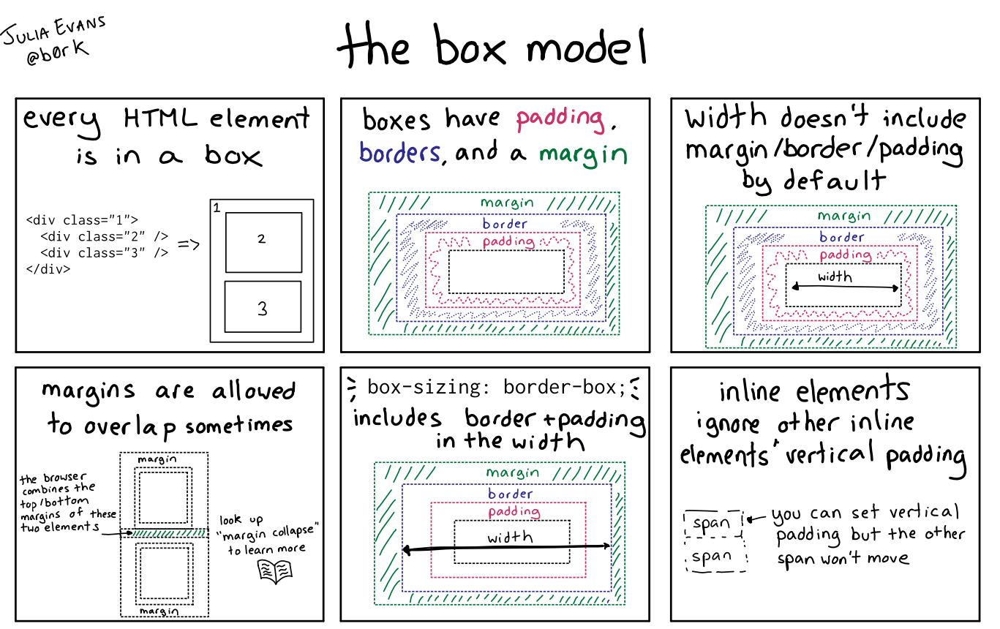

import InteractiveCode from '../../../../components/InteractiveCode.astro';
import { Quiz } from 'starlight-quiz/components';

Every element on a web page is a rectangular box. Every box has four layers.

Think of it like a gift:

- The **content** is the gift itself
- **Padding** is the tissue paper around it
- **Border** is the box edge
- **Margin** is the space between this gift and the next one on the table



Here is an example showing all four layers at once. Try changing the numbers to see what happens:

<InteractiveCode
  html={`<div class="box">
  <p>This is the content area.<br>Try editing the CSS!</p>
</div>
<div class="box">
  <p>A second box shows how margin creates space between elements.</p>
</div>`}
  css={`/* The four parts of the box model */
.box {
  width: 200px;
  padding: 20px;            /* space between content and border */
  border: 3px solid #e37e40; /* edge around the padding */
  margin: 20px;             /* space outside the border */
  background: #ffe6d0;
  border-radius: 4px;
}`}
/>

<p>Try changing <code>padding</code> to <code>40px</code>. What happens to the space between the text and the orange border? Try changing <code>margin</code> to <code>5px</code>. How close do the two boxes get?</p>

Now let's look at each layer one at a time.

## Content — The Innermost Layer

The **content** is where text, images, or other elements live. You control its size with `width` and `height`.

```css
.box {
  width: 250px;
  height: 100px;
}
```

If you do not set a `width`, a block-level element will stretch to fill its container. Inline elements are only as wide as their content.

<InteractiveCode
  html={`<div class="box">This box has a fixed width of 250px.</div>
<div class="box">So does this one.</div>
<div class="no-width">This box has no width set — it fills the container.</div>`}
  css={`.box {
  width: 250px;
  background: #cce5ff;
  padding: 10px;
}

.no-width {
  background: #d4edda;
  padding: 10px;
}`}
/>

<Quiz id="box-model-width" title="Content width">
What does the <code>width</code> property control in the box model?

- [ ] The total width including padding and border
- [ ] The space outside the border
- [x] The width of the content area
- [ ] The thickness of the border

If you do not set a <code>width</code> on a block-level element, it will:

- [ ] Collapse to zero width
- [x] Stretch to fill its container
- [ ] Take the width of its content only
- [ ] Become invisible
</Quiz>

## Padding — Space Inside the Border

**Padding** is the space between the content and the border. It pushes the border outward from the content.

A useful trick: if you set a background color on an element, the background extends into the padding area — so padding looks like extra "breathing room" around the text.

```css
.box {
  padding: 20px;     /* 20px on all four sides */
  padding: 10px 20px; /* 10px top/bottom, 20px left/right */
  padding-top: 15px;  /* just the top */
}
```

<InteractiveCode
  html={`<div class="box box-small">
  <p>Small padding (10px)</p>
</div>
<div class="box box-large">
  <p>Large padding (40px)</p>
</div>`}
  css={`.box {
  width: 200px;
  background: #ffe6d0;
  border: 2px solid #e37e40;
}

.box-small {
  padding: 10px;
}

.box-large {
  padding: 40px;
}

p {
  margin: 0;
}`}
/>

The two boxes have the same `width: 200px`, but the second one looks much bigger because of its larger padding. Notice how the background color fills the padding area.

<p>Try changing <code>.box-large</code> padding to <code>10px</code>. Do the boxes look the same now? Try setting the padding on <code>.box</code> to <code>10px 60px</code> — what changes?</p>

<Quiz id="box-model-padding" title="Padding">
What does padding control?

- [x] The space between content and border
- [ ] The space outside the border
- [ ] The width of the border
- [ ] The background color

If two elements have the same <code>width</code> but different padding, the one with more padding will:

- [ ] Have less content space
- [x] Have the same content width but appear larger overall
- [ ] Be pushed to the right
- [ ] Have a thicker border
</Quiz>

## Border — The Edge Around Padding

The **border** sits right on the edge of the padding. It is the visible boundary of the box.

Borders have three parts: **width**, **style**, and **color**. You usually write them as shorthand:

```css
.box {
  border: 2px solid black;
  /*   ↑width  ↑style ↑color */
}
```

The `style` is required — if you leave it out, the border defaults to `none` and nothing shows.

```css
border: 5px dashed #e37e40;  /* a dashed orange border */
border: 3px dotted navy;     /* a dotted navy border */
border: 1px solid #ccc;      /* a thin gray solid border — very common */
```

<InteractiveCode
  html={`<div class="box no-border">No border (style missing)</div>
<div class="box solid-border">Solid border</div>
<div class="box dashed-border">Dashed border</div>`}
  css={`.box {
  width: 200px;
  padding: 15px;
  margin: 10px;
  background: #f0f0f0;
}

.no-border {
  border: 3px red; /* style is missing — no border shows */
}

.solid-border {
  border: 3px solid #2c7be5;
}

.dashed-border {
  border: 3px dashed #e37e40;
}`}
/>

<p>Notice the first box — even though <code>border: 3px red</code> sets a width and color, no border shows because the style is missing. Change it to <code>border: 3px solid red</code> and see what happens.</p>

<Quiz id="box-model-border" title="Border">
Which part of the border declaration is required for a border to show?

- [ ] width
- [x] style
- [ ] color
- [ ] All three are required

Which of these will create a visible border?

- [ ] <code>border: 2px blue;</code>
- [x] <code>border: 2px solid blue;</code>
- [ ] <code>border: solid blue;</code>
- [ ] <code>border: 2px blue hidden;</code>
</Quiz>

## Margin — Space Outside the Border

**Margin** is the space outside the border. It pushes other elements away.

Unlike padding, margin is transparent — it never shows a background color.

```css
.box {
  margin: 20px;      /* 20px on all four sides */
  margin: 10px 30px; /* 10px top/bottom, 30px left/right */
  margin-top: 40px;  /* just the top */
}
```

<InteractiveCode
  html={`<div class="box">Box 1</div>
<div class="box">Box 2</div>
<div class="box">Box 3</div>`}
  css={`.box {
  width: 150px;
  padding: 15px;
  border: 2px solid #2c7be5;
  background: #d9eaff;
  margin: 20px;
}`}
/>

The space you see between the blue boxes is the margin. Try setting margin to `5px` — the boxes almost touch. Try `50px` — they spread far apart.

### A Note on Margin Collapsing

When two vertical margins touch, they collapse into a single margin equal to the larger of the two. Horizontal margins never collapse.

```css
/* If one box has margin-bottom: 30px and the next
   has margin-top: 20px, the space between them is
   30px — not 50px. The larger margin "wins". */
```

<InteractiveCode
  html={`<div class="box">This box has <code>margin-bottom: 40px</code></div>
<div class="box second">This box has <code>margin-top: 20px</code></div>
<p>How much space is between them? It should be 40px (the larger), not 60px.</p>`}
  css={`.box {
  width: 200px;
  padding: 15px;
  border: 2px solid #2c7be5;
  background: #d9eaff;
  margin-bottom: 40px;
}

.second {
  margin-top: 20px;
}`}
/>

<p>Try changing <code>margin-bottom</code> on the first box to <code>10px</code>. Now which margin wins?</p>

<Quiz id="box-model-margin" title="Margin">
What does margin control?

- [ ] Space between content and border
- [ ] The thickness of the border
- [x] Space outside the border between elements
- [ ] The inner padding of a container

If one element has <code>margin-bottom: 30px</code> and the next has <code>margin-top: 10px</code>, how much vertical space appears between them?

- [ ] 40px
- [ ] 10px
- [ ] 20px
- [x] 30px
</Quiz>

## The Total Width Gotcha

Here is something that trips up almost every beginner.

By default, `width` sets the width of the **content area only**. Padding and border are added on top.

```css
.box {
  width: 300px;
  padding: 20px;
  border: 2px solid black;
}
```

**Actual total width**: 300 (content) + 40 (left + right padding) + 4 (left + right border) = **344px**

This is the default behavior, called `content-box`.

### Fixing It with `box-sizing: border-box`

The property `box-sizing` changes what `width` includes. Set it to `border-box` and `width` will include padding and border in its calculation.

```css
.box {
  box-sizing: border-box;  /* ← the fix */
  width: 300px;
  padding: 20px;
  border: 2px solid black;
}
```

**Actual total width**: exactly **300px**. Padding and border are subtracted from the content area instead of added.

Many developers set this on every element from the start:

```css
/* A common reset — put this at the top of your CSS */
* {
  box-sizing: border-box;
}
```

<InteractiveCode
  html={`<h3>content-box (default)</h3>
<div class="box content-box">I set width: 300px<br>But I'm actually wider!</div>

<h3>border-box</h3>
<div class="box border-box">I set width: 300px<br>And I'm exactly 300px!</div>`}
  css={`.box {
  width: 300px;
  padding: 25px;
  border: 5px solid #2c7be5;
  background: #d9eaff;
  margin-bottom: 10px;
}

.content-box {
  box-sizing: content-box;
  background: #ffe6d0;
  border-color: #e37e40;
}

.border-box {
  box-sizing: border-box;
  background: #d4edda;
  border-color: #28a745;
}`}
/>

Both boxes have `width: 300px`, `padding: 25px`, and `border: 5px`. The first one uses the default `content-box` and is actually 360px wide. The second uses `border-box` and stays exactly 300px.

<p>Switch the second box to <code>box-sizing: content-box</code>. What happens to its total width? Add <code>box-sizing: border-box</code> to the first box — does it get smaller?</p>

<Quiz id="box-model-box-sizing" title="Box-sizing">
By default (<code>box-sizing: content-box</code>), the <code>width</code> property sets the width of which part?

- [ ] The total element including padding, border, and margin
- [x] The content area only
- [ ] The content area plus padding
- [ ] The content area plus border

An element has <code>width: 200px; padding: 10px; border: 2px solid black;</code>. What is its total width with the default <code>box-sizing</code>?

- [ ] 200px
- [ ] 210px
- [ ] 202px
- [x] 224px

Which <code>box-sizing</code> value makes <code>width</code> include padding and border?

- [ ] <code>content-box</code>
- [x] <code>border-box</code>
- [ ] <code>padding-box</code>
- [ ] <code>margin-box</code>
</Quiz>

## Inspecting the Box Model in DevTools

Your browser's DevTools show you the exact box model for any element. Right-click any element on a page and choose **Inspect**. In the "Styles" or "Computed" panel (depending on your browser), you will see a diagram of the box with content, padding, border, and margin values.

This is the fastest way to debug layout problems — if something looks wrong, open DevTools and check the box model.

More detailed instructions are in the [DevTools section](../devtools/).

## Summary

| Layer | What it does | Background shows? | Space added to total width? |
|---|---|---|---|
| **Content** | Where text/images live | Yes | This is the baseline |
| **Padding** | Space between content and border | Yes | Yes (in `content-box` mode) |
| **Border** | Visible edge around padding | Has its own color | Yes |
| **Margin** | Space outside the border, between elements | No | No (affects layout, not element size) |

If you remember only one thing from this page: **use `box-sizing: border-box`** to avoid surprise width calculations.

Now that you understand the box model, you are ready to explore [CSS Layout](../css-layout/) — where you will use these concepts to position elements on the page.
