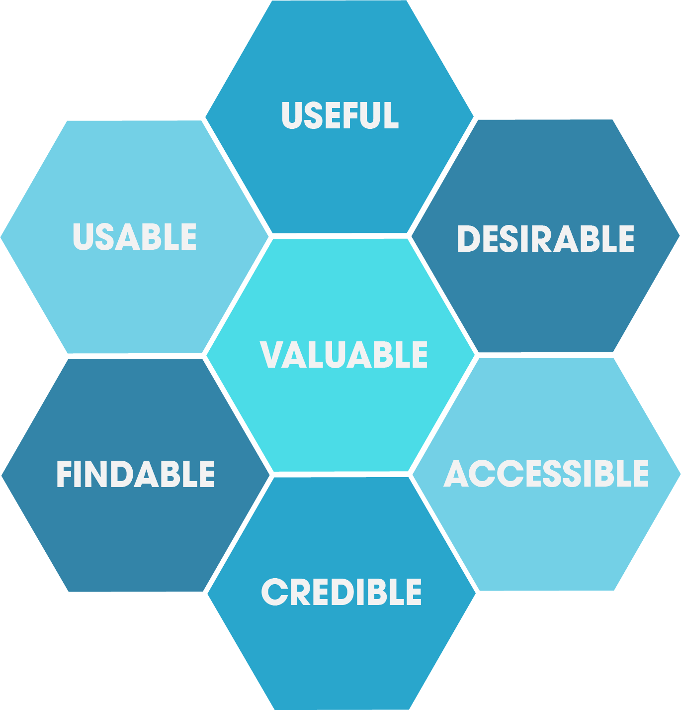

import { LinkCard } from '@astrojs/starlight/components';

import InteractiveCode from '../../../../components/InteractiveCode.astro';
import { Quiz } from 'starlight-quiz/components';

Adapted from Chapter 3 of the Interaction Design Foundation's *Basics of UX Design*. The framework comes from Peter Morville's **UX honeycomb** — seven qualities that together decide whether a product succeeds. The mobile readings below are written for this course.

**Usability** (how easy something is to use) is only one cell of the honeycomb. UX is the whole honeycomb.

*Diagram by Peter Morville / Andrew Lehti, via [Wikimedia Commons](https://commons.wikimedia.org/wiki/File:UX_Honeycomb.png) (CC0 public domain). Also featured on [Wikipedia's User interface article](https://en.wikipedia.org/wiki/User_interface).*

## 1. Useful — does it solve a real problem?

If a product isn't useful to someone, why bring it to market? **Useful** is in the eye of the beholder — a game is useful for stress relief, a sculpture for inspiration — but there must be *some* real human purpose.

Mobile test: can you state the purpose in one sentence without naming a feature? "Commuters want to know if their bus is late, because waiting without information is stressful" passes. "Our app uses Expo with a purple theme" fails — that's a solution looking for a problem.

Write your usefulness sentence *before* sketching screens. You'll reuse it as your problem statement in [User-Centered Design](../user-centered-design/).

## 2. Usable — can thumbs do it quickly and correctly?

**Usability** means users can achieve their goal effectively and efficiently. On phones, that mostly means respecting fingers, thumbs, and distraction:

- **Tap targets at least 44×44 points** (Apple) / 48×48 dp (Material) — fingers are imprecise
- **Thumb zone first** — primary actions low and centered, destructive actions away from thumbs
- **Fewer steps and less typing** — short forms, smart defaults, persistent sign-in, single-direction scrolling
- **Match platform habits** — tab bars, back gestures, and system controls users already know

Compare the two rows below — both "work," but only one is usable on a moving bus:

<InteractiveCode
  html={`

  <h2>Pick a route</h2>
  
Tiny targets vs. thumb-friendly targets.

  

    <button>5</button><button>8</button><button>12</button><button>21</button>
  

  

    <button>Route 5</button><button>Route 8</button>
  

`}
  css={`
.phone { max-width: 380px; margin: 0 auto; padding: 24px; font-family: system-ui, sans-serif; border: 1px solid #ddd; border-radius: 16px; }
.muted { color: #555; }
.row { display: flex; gap: 8px; margin-top: 12px; }
.tiny button { padding: 2px 6px; font-size: 12px; }
.big button { flex: 1; min-height: 48px; font-size: 16px; border-radius: 10px; background: #14213d; color: #fff; border: none; }
`}
/>

Try changing the `.tiny button` padding to `min-height: 48px` and re-test with your own thumb. Notice the error rate drop — that's usability you can feel.

<Quiz id="mobile-ux-usable" title="Usable on mobile">
Tiny 24px buttons crammed together mainly violate which factor?

- [ ] Desirable
- [x] Usable
- [ ] Credible
- [ ] Valuable
</Quiz>

## 3. Findable — can people locate the app and what's inside it?

**Findable** works at two levels on mobile: *store* findability (name, keywords, screenshots, ratings that surface the app) and *in-app* findability (users locating content without hunting).

Think of a newspaper with randomly ordered pages, or a music store with unsorted racks — that's an app with five tabs, a hamburger menu, and identically labeled screens. Time feels precious, so users stop browsing instead of digging.

Mobile guidelines:

- **Prioritize navigation** — the most-used destination first; keep depth shallow (tab bar beats nested drawers for top tasks)
- **Label clearly** — short, concrete words ("Arrivals", not "Explore")
- **Support search and deep links** — let users jump straight to content from search or a shared link

You'll go deeper in [Navigation & App Architecture](../navigation-architecture/).

## 4. Credible — will they trust it?

Users won't give you a second chance to fool them — alternatives are seconds away. **Credibility** means users believe the app does what it claims, lasts, and tells the truth.

On mobile, trust is won or lost at specific moments:

- Honest **permission prompts** ("Location is used to show nearby stops" — not "Allow tracking?")
- Accurate data with visible timestamps ("Updated 30 seconds ago")
- Real contact info, privacy policy, and store reviews that match the experience
- No dark patterns — pre-checked subscriptions and fake countdowns destroy trust and invite one-star reviews

<Quiz id="mobile-ux-credible" title="Credible">
Which detail builds credibility in a transit app?

- [ ] A fake "only 2 seats left!" banner on every screen
- [x] "Arrival times updated 30 seconds ago" plus a visible data source
- [ ] Hiding the privacy policy
- [ ] Requesting location access with no explanation
</Quiz>

## 5. Desirable — do they actually want it?

Two cars can both be useful, usable, and safe — yet most people given the free choice pick the one with power and style. That's **desirability**: branding, identity, aesthetics, and emotional design layered on top of function.

For apps, desirability comes from platform-native polish: consistent type and spacing, meaningful motion, haptics that confirm actions, and an icon and launch screen you'd be proud to keep on a home screen. The more desirable the app, the more users show it off — desire spreads.

Desirability never rescues a useless app. It multiplies a useful one.

## 6. Accessible — can everyone use it, including with assistive tech?

**Accessibility** means people across the full range of abilities — vision, hearing, motion, cognition — can use the experience. Roughly one in five U.S. adults reported a disability in census data; designing without them excludes a fifth of your market and, in many jurisdictions, risks legal exposure.

The payoff: accessible choices help everyone (captions on a noisy bus, large type in sunlight). On mobile, start with:

- **Contrast** — text that passes WCAG ratios at small sizes
- **Dynamic Type support** — layout survives larger text settings
- **Screen readers** — meaningful labels for VoiceOver / TalkBack, logical focus order
- **No touch-only meaning** — color plus a label or icon, never color alone

Test the contrast pair below, then continue in [Accessibility](../accessibility/):

<InteractiveCode
  html={`

  <h2>Next bus</h2>
  
Route 5 — leaves in 4 min

  
Route 5 — leaves in 4 min

`}
  css={`
.phone { max-width: 380px; margin: 0 auto; padding: 24px; font-family: system-ui, sans-serif; border: 1px solid #ddd; border-radius: 16px; }
.low { color: #aaaaaa; background: #ffffff; padding: 12px; }
.high { color: #1a1a1a; background: #ffd60a; padding: 12px; font-weight: 600; }
`}
/>

Try changing the `.low` color toward `#555` until it feels readable, then compare with `.high`. That gap is the difference between decoration and access.

<Quiz id="mobile-ux-accessible" title="Accessible">
Designing for accessibility primarily means:

- [ ] Adding more animations
- [x] Making the app usable across the full range of abilities, including assistive tech
- [ ] Supporting only the newest phone model
- [ ] Using smaller text to fit more content
</Quiz>

## 7. Valuable — is it worth it for the user and for you?

Finally, the product must deliver **value** to both sides: the user who spends time, attention, or money, and the business or team that builds it. Without that exchange, early traction corrodes.

A designer's rule of thumb: a $100 product that solves a $10,000 problem succeeds; a $10,000 product that solves a $100 problem doesn't. For your final project, scope is the value lever — a small app that fully solves one painful problem beats a sprawling app that half-solves five.

<Quiz id="mobile-ux-honeycomb" title="The honeycomb">
Which list names all seven UX honeycomb factors?

- [ ] Fast, cheap, pretty, fun, new, loud, big
- [x] Useful, usable, findable, credible, desirable, accessible, valuable
- [ ] Research, define, ideate, prototype, test, repeat, ship
- [ ] iOS, Android, web, watch, TV, tablet, desktop
</Quiz>

## Take away

Products that are useful, usable, findable, credible, desirable, accessible, and valuable are far more likely to succeed. When critiquing any screen — yours or a classmate's — name the factor that's failing before proposing a fix. That shared vocabulary is the point of the honeycomb.

## Learn more

- <LinkCard title="UX vs. UI (Video)" href="/courses/dmd-3440/mobile-ux-design/ux-vs-ui-video/" description="Watch on dedicated video page." />
- [NN/g: UX vs. UI](https://www.nngroup.com/videos/ux-vs-ui/)
- [Apple Human Interface Guidelines](https://developer.apple.com/design/human-interface-guidelines/)
- [Material Design](https://m3.material.io/)
