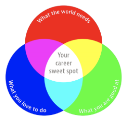

Excluding materials for purchase, syllabus information may be subject to change. The most up-to-date syllabus is located within the course in HuskyCT.

## Course And Instructor Information

| | |
| --- | --- |
| Course Title | Portfolio and Professional Development |
| Credits | 3 |
| Format | In-person - BISH |
| Prerequisites | Open to senior BFA Digital Media and Design majors only, others by instructor consent. |
| Instructor | Brian Daley |
| Pronouns | he/him/his |
| Email | [brian@uconn.edu](mailto:brian@uconn.edu) |
| Office Hours | By Appointment |

## Course Materials

### Domain name + web hosting service

**You will need to purchase your own domain name as part of developing a personal portfolio website during this course.** You might also want to opt for a paid web-hosting service. More details about web hosting services and where you can acquire a domain name are provided in the course resources.

### Software

You should have access to Adobe Creative Cloud for development of your professional materials. You should have received directions from the DMD department about registering for Adobe Creative Cloud. Please let me know if you have any questions about accessing the software you need.

### External Hard Drive

You will need an external hard drive where you can store your work.

### Data Back-up

Maintaining a back-up system is a responsible and necessary task in this digital age. Along with the benefit of owning your own hardware comes the responsibility of maintaining it so data is safe. Hardware problems are no excuse for late or missing work. Apple offers its software Time Machine. Another is an app called Super Duper. Online back-up systems like CrashPlan are also available. Whatever back-up system you select, maintain it regularly.

## Course Description

"DMD 4025 - Portfolio & Professional Development," more commonly referred to as "Putting It All Together," is designed to support senior DMD BFA students in the development of skills and materials that will help them to establish and achieve post-graduation goals. The course provides guidance in the preparation of a portfolio website, a show reel, résumé, LinkedIn page, personal elevator pitch, and three-year plan. Through this course, students will be supported in seeking out professional opportunities, and they will enhance their written and presentation skills for professional internships and jobs through cover letter development, in-class presentations, and mock interviews.

## Course Objectives

The goal of this course is for students to understand what is required to present themselves for professional opportunities and to prepare the materials necessary to succeed in this effort. Put in another way, this course aims to help students identify their "career sweet spot" (the intersection of personal passions and skills with global and marketplace needs), and to support students in developing skills and materials that will help them pursue professional opportunities within their "career sweet spot."

## Course Outline

:::caution
**Weekly topics will shift** due to the scheduling of guest speakers. As a result, the following course outline is subject to change with notification.
:::

### Week 1: Introduction

- Course Introduction
- Review syllabus and course goals
- --
- Review assignment: for Professional Goals + Three-Year Plan
- Vault Exercise
- Documenting your current questions about professional and portfolio development

### Week 2: Professional Goals + Three-Year Plans

- Tue. Class Canceled for Instructor Illness
- Due: 5 minute presentation introducing yourself and presenting your professional goals and three-year plan to the class
- --
- Presentations: Written Professional Goals + Three-Year Plan
- Discuss Resume assignment and requirements
- Reminder: Be on time for guest lecture on Tuesday!

### Week 3: Résumés

- 9/10 - Guest Lecture/Presentation on Resumes by [Steve Kligerman](https://career.uconn.edu/staff/#steve-kligerman)
- Reminder: First draft of resume is due next class.
- ---
- Resume Workshop: Quinncia
- Resume Peer reviews
- Revise résumé for career fair

### Week 4: Portfolio Website Inspirations, About Pages + Website Goals

- 9/17 - No class. Please attend [UConn Fall All-University Career Fair](https://career.uconn.edu/resources/career-fairs/)
  - Take a selfie at the career fair to receive extra participation points (Do not send them to me!)
- ---
- REMINDER: [Apply for Graduation](https://kb.uconn.edu/space/SAS/10769929332)
- REMINDER: [Submit Your Final Plan of Study](https://kb.uconn.edu/space/SAS/10769929330/Submitting+Your+Final+Plan+of+Study)!
- REMINDER: [DMCT Summit](https://digitalmediact.com/summit/) 9/27
  - Bus Transportation provided
  - Meals provided
  - Confirmed companies: Paramount, WWE, ITV America
  - [UConn Student Registration](https://forms.office.com/pages/responsepage.aspx?id=fqjxFyUqqk65351DkDSwgNhbHkEeNJVHiYDO5WA2YfpUQlkxWDUzTzI2Q0Y4UDNQNFhUNVNXNVRLNy4u&origin=lprLink&route=shorturl)
- Show proof of attendance at the career fair
- Discuss Portfolio Website Assignment

### Week 5: In-Progress portfolio website review

- Grad School Presentation
- Discuss Assignment: Show reel inspirations statement
- --
- Discuss Assignment: Show Reels
- Tips for enhancing your show reel

### Week 6: LinkedIn Profiles

- Discuss Assignment: LinkedIn Profile
- Work Day! Get help/feedback on...
  - Portfolio Website
  - Show Reel
- --
- 10/3 - Guest Lecture/Presentation on LinkedIn by [Steve Kligerman](https://career.uconn.edu/staff/#steve-kligerman)
- In-class activity: LinkedIn Workshop or Website Check-ins

### Week 7: Show Reel Work Week

- Due before the start of class: Show reel inspirations
- Discussion of show reel inspirations
- ---
- 10/10 - Guest Lecture/Presentation on Interviewing by [Steve Kligerman](https://career.uconn.edu/staff/#steve-kligerman)
- Reminder: Show reel first cut due Week 9

### Week 8: Job/Internship Searches + Cover Letters

- 10/15 - LinkedIn Assignment due!
- No classes (Covid kicked Brian's bum)

### Week 9: Show Reel + Interviewing

- Topic: The Job Search
- ---
- **10/24**
- Topic: Cover Letters
- Discuss Assignment: Job Search + Cover Letter
- Reminder: Draft show reel presentation next class

### Week 10: Personal Elevator Pitches

- **10/29**
- [Alumni Panel Survey](https://nam10.safelinks.protection.outlook.com/?url=https%3A%2F%2Fforms.office.com%2FPages%2FResponsePage.aspx%3Fid%3DfqjxFyUqqk65351DkDSwgI3YmKGz_3RPnx0eqUoZ-KpUODZHQUdGNjUxWFhQVk0zQklHQVlaNjI2Si4u&data=05%7C02%7Cbrian%40uconn.edu%7C0a9b377a6b7a4d81744f08dcf83ddf6e%7C17f1a87e2a254eaab9df9d439034b080%7C0%7C0%7C638658191903768899%7CUnknown%7CTWFpbGZsb3d8eyJWIjoiMC4wLjAwMDAiLCJQIjoiV2luMzIiLCJBTiI6Ik1haWwiLCJXVCI6Mn0%3D%7C0%7C%7C%7C&sdata=aT3QFzvL%2FVy37hxwLWOL46VMPjYnilb%2BfrD6Yt1Ax58%3D&reserved=0) - Please fill out ASAP
- In-class demo + crit: First cut of show reel due
- Reminder: Draft cover letter due next class
- ---
- **10/31**
- [Alumni Panel Survey](https://nam10.safelinks.protection.outlook.com/?url=https%3A%2F%2Fforms.office.com%2FPages%2FResponsePage.aspx%3Fid%3DfqjxFyUqqk65351DkDSwgI3YmKGz_3RPnx0eqUoZ-KpUODZHQUdGNjUxWFhQVk0zQklHQVlaNjI2Si4u&data=05%7C02%7Cbrian%40uconn.edu%7C0a9b377a6b7a4d81744f08dcf83ddf6e%7C17f1a87e2a254eaab9df9d439034b080%7C0%7C0%7C638658191903768899%7CUnknown%7CTWFpbGZsb3d8eyJWIjoiMC4wLjAwMDAiLCJQIjoiV2luMzIiLCJBTiI6Ik1haWwiLCJXVCI6Mn0%3D%7C0%7C%7C%7C&sdata=aT3QFzvL%2FVy37hxwLWOL46VMPjYnilb%2BfrD6Yt1Ax58%3D&reserved=0) - Please fill out ASAP
- Bring to class:
  - Printouts of 2 potential internships/jobs
  - A DRAFT cover letter for **one** of the internships/jobs
- Topic: The Elevator Pitch
- Discuss Assignment: Your personal elevator pitch

### Week 11: Putting Yourself Out There Goals

- **11/5**
- Due: Job Search + Cover Letter (Final Draft)
- Discuss Assignment: Putting Yourself Out There Goals
- ---
- **11/7**
- Present a draft of your personal elevator pitch
- Work day: Portfolio Website, Show reel, or Elevator Pitch

### Week 12: Mock Interviews + Individual check-ins

- **11/12**
- Topic: Interviews (introduction)
- Discuss Assignment: Mock Interviews
- --
- **11/14**
- Work Day: Prepare final revisions of materials: elevator pitch, portfolio website, show reel

### Week 13: Financial Literacy + Final Revisions to Materials

- Topic: Financial Literacy
- ---
- Alumni Panel! 1-3pm in Bishop 146

### Thanksgiving Recess: No Class!

Sun, Nov 24 - Sat, Nov 30

### Week 14: Final Presentations

- Work Day: Prepare final revisions of materials: elevator pitch, portfolio website, show reel
- ---
- Final presentations of elevator pitch, portfolio website, and show reel

## Course Requirements and Grading

Assessment for this course consists of participation and professional behavior, development of a portfolio website, development of materials for professional presentation, and a final presentation and submission of all materials developed in the course. Your overall grade will be based on your understanding of the information and ideas discussed, and your formal, technical, and conceptual progress as demonstrated in projects and presentations, as well as overall professionalism. Because the goal of the class is for you to develop and enhance your skills, you will receive regular feedback from the professor, peers, and outside experts, and you will have the opportunity to revise and improve your work. How revised work affects grade calculations will be detailed for specific projects. Late work: There are no make-ups for in-class projects without preapproval. Assignments turned in late without a preapproved extension will be marked down 10% for each day they are late. (No credit will be given after an assignment is ten days late). Presentations: All presentations that you make in the class should stay within the time limits identified for a specific presentation and should be prepared in advance and rehearsed. Written Work: All written work must be submitted in Word or PDF formats. This allows me to provide feedback directly within HuskyCT. **Submitting a link will result in a zero for written assignments. Do not submit a link! (Google Docs or otherwise.)**

| Item | Percentage |
| --- | --- |
| Participation: Active engagement in class discussions and critiques | 14% |
| A. Career Mission Statement + Three-Year Plan | 8% |
| B. Portfolio Website | 18% |
| C. Résumé | 8% |
| D. LinkedIn Profile | 6% |
| E. Show Reel | 12% |
| F. Putting Yourself Out There! Goals | 6% |
| G. Job Search + Cover letter | 8% |
| H. Elevator Pitch + Portfolio Presentation | 6% |
| I. Mock Interview | 8% |
| J. Final Presentation | 6% |
| Total | 100% |

### Standard Grades

| Grade | Letter Grade | GPA |
| --- | --- | --- |
| 93-100 | A | 4.0 |
| 90-92 | A- | 3.7 |
| 87-89 | B+ | 3.3 |
| 83-86 | B | 3.0 |
| 80-82 | B- | 2.7 |
| 77-79 | C+ | 2.3 |
| 73-76 | C | 2.0 |
| 70-72 | C- | 1.7 |
| 67-69 | D+ | 1.3 |
| 63-66 | D | 1.0 |
| 60-62 | D- | 0.7 |
| <60 | F | 0.0 |

### Letter Grade Explanation

#### [A] Excellent.

Student exhibits mastery of the material covered in class; demonstrates creativity and attention to detail in the development of course materials; spoken, visual and written presentation materials are professional, clear, and compelling; work may extend above and beyond the stated requirements for a given project or assignment.

#### [B] Good.

Student exhibits a solid understanding of material covered in class; demonstrates some consistency in creativity and attention to detail in the development of course materials; spoken, visual, and written presentation materials are for the most part professional, clear, and engaging.

#### [C] Fair.

Student exhibits a basic understanding of material covered in class; student is inconsistent in the creativity and attention to detail shown in the development of course materials; spoken, visual, and written presentation materials may not be engaging and may lack professionalism and clarity.

#### [D] Poor.

Student does not demonstrate even a basic understanding of material covered in class; work may be sloppy or perfunctory in approach; spoken, visual, and written presentation materials are not well-prepared and lack professionalism and clarity.

#### [F] Failure.

Student fails to complete the assignments as stated; fails to submit assignments; shows extensive misunderstanding of the material; plagiarism; illiteracy; excessive absences or lateness.

#### [I] Incomplete.

Incompletes are given at the discretion of the course instructor.

### Due Dates and Late Policy

All course due dates are identified in HuskyCT. Deadlines are based on Eastern Time unless otherwise specified. The instructor reserves the right to change dates accordingly as the semester progresses. All changes will be communicated in an appropriate manner.

### Feedback and Grading

I will make every effort to provide feedback and grades in a reasonable timeframe. To keep track of your performance in the course, refer to My Grades in HuskyCT.

### Weekly Time Commitment

You should expect to dedicate 6 to 9 hours a week to this course. This expectation is based on the various course activities, assignments, and assessments and the [University of Connecticut's policy regarding credit hours](https://policy.uconn.edu/2012/08/22/credit-hour/). (More information related to hours per week per credit can be accessed at the [Online Student website](https://onlinestudent.uconn.edu/learn-more/#collapsepanel-269-1-0-07)).

## Resources for Students Experiencing Distress

The University of Connecticut is committed to supporting students in their mental health, their psychological and social well-being, and their connection to their academic experience and overall wellness. The university believes that academic, personal, and professional development can flourish only when each member of our community is assured equitable access to mental health services. The university aims to make access to mental health attainable while fostering a community reflecting equity and diversity and understands that good mental health may lead to personal and professional growth, greater self-awareness, increased social engagement, enhanced academic success, and campus and community involvement. Students who feel they may benefit from speaking with a mental health professional can find support and resources through the [Student Health and Wellness-Mental Health](https://counseling.uconn.edu/) (SHaW-MH) office. Through SHaW-MH, students can make an appointment with a mental health professional and engage in confidential conversations or seek recommendations or referrals for any mental health or psychological concern. Mental health services are included as part of the university's student health insurance plan and also partially funded through university fees. If you do not have UConn's student health insurance plan, most major insurance plans are also accepted. Students can visit the Student Health and Wellness-Mental Health located in Storrs on the main campus in the Arjona Building, 4th Floor, or contact the office at (860) 486-4705, or [studenthealth.uconn.edu](https://studenthealth.uconn.edu) for services or questions.

## Accommodations For Illness Or Extended Absences

Please stay home if you are feeling ill and please go home if you are in class and start to feel ill. If illness prevents you from attending class, it is your responsibility to notify your instructor as soon as possible. You do not need to disclose the nature of your illness, however, you will need to work with your instructor to determine how you will complete coursework during your absence. If life circumstances are affecting your ability to focus on courses and your UConn experience, students can email the Dean of Students at [dos@uconn.edu](mailto:dos@uconn.edu) to request support. Regional campus students should email the Student Services staff at their home campus to request support and faculty notification.

## Student Responsibilities And Resources

As a member of the University of Connecticut student community, you are held to certain standards and academic policies. In addition, there are numerous resources available to help you succeed in your academic work. Review these important [standards, policies and resources](https://onlinestudent.uconn.edu/learn--more/#POL), which include:

- Academic Integrity
  - The Student Code
  - Resources on Avoiding Cheating and Plagiarism
- Copyrighted Materials
- Credit Hours and Workload
- Netiquette and Communication
- Adding or Dropping a Course
- Academic Calendar
- Policy Against Discrimination, Harassment and Inappropriate Romantic Relationships
- Sexual Assault Reporting Policy

## Students With Disabilities

The University of Connecticut is committed to protecting the rights of individuals with disabilities and assuring that the learning environment is accessible. If you anticipate or experience physical or academic barriers based on disability or pregnancy, please let me know immediately so that we can discuss options. Students who require accommodations should contact the Center for Students with Disabilities, Wilbur Cross Building Room 204, (860) 486-2020 or [csd.uconn.edu](http://csd.uconn.edu/). Blackboard measures and evaluates accessibility using two sets of standards: the WCAG 2.0 standards issued by the World Wide Web Consortium (W3C) and Section 508 of the Rehabilitation Act issued in the United States federal government. (Retrieved March 24, 2013 from [Blackboard's website](http://www.blackboard.com/platforms/learn/resources/accessibility.aspx))

## Software/technical Requirements (With Accessibility And Privacy Information)

The software/technical requirements for this course include:

- HuskyCT/Blackboard ([HuskyCT/Blackboard Accessibility Statement](http://www.blackboard.com/Platforms/Learn/Resources/Accessibility.aspx), [HuskyCT/Blackboard Privacy Policy](http://www.blackboard.com/footer/privacy-policy.aspx))
- [Adobe Acrobat Reader](http://www.adobe.com/products/acrobat/readstep2.html) ([Adobe Reader Accessibility Statement](http://www.adobe.com/accessibility/products/reader.html), [Adobe Reader Privacy Policy](http://www.adobe.com/privacy.html))
- Google Apps ([Google Apps Accessibility](https://www.google.com/accessibility/), [Google for Education Privacy Policy](https://www.google.com/edu/trust/))
- Microsoft Office (free to UConn students through [uconn.onthehub.com](https://uconn.onthehub.com)) ([Microsoft Accessibility Statement](http://www.microsoft.com/enable/microsoft/mission.aspx), [Microsoft Privacy Statement](https://privacy.microsoft.com/en-us/privacystatement/))
- Dedicated access to high-speed internet with a minimum speed of 1.5 Mbps (4 Mbps or higher is recommended).
- WebCam

For information on managing your privacy at the University of Connecticut, visit the [University's Privacy page](https://privacy.uconn.edu/). NOTE: This course has NOT been designed for use with mobile devices.

## Help

[Technical and Academic Help](https://onlinestudent.uconn.edu/frequently-asked-questions/) provides a guide to technical and academic assistance. This course uses the learning management platform, [HuskyCT](http://huskyct.uconn.edu/). If you have difficulty accessing HuskyCT, you have access to the in person/live person support options available during regular business hours through the [Help Center](http://helpcenter.uconn.edu/). You also have [24x7 Course Support](http://www.ecampus24x7.uconn.edu/) including access to live chat, phone, and support documents.

## Student Technology Training

Student technology training is now available in a new HuskyCT short course created by students for students. It will prepare you to use the IT systems and services that you will use throughout your time at UConn, whether learning online or on-campus. It is available at <https://lms.uconn.edu/ultra/courses/_80016_1/cl/outline>.

## Evaluation Of Course Experience

Students will be given an opportunity to provide feedback on their course experience and instruction using the University's standard procedures, which are administered by the [Office of Institutional Research and Effectiveness](http://www.oire.uconn.edu/) (OIRE). The University of Connecticut is dedicated to supporting and enhancing teaching effectiveness and student learning using a variety of methods. The Student Evaluation of Teaching (SET) is just one tool used to help faculty enhance their teaching. The SET is used for both formative (self-improvement) and summative (evaluation) purposes. Additional informal formative surveys and other feedback instruments may be administered within the course.
